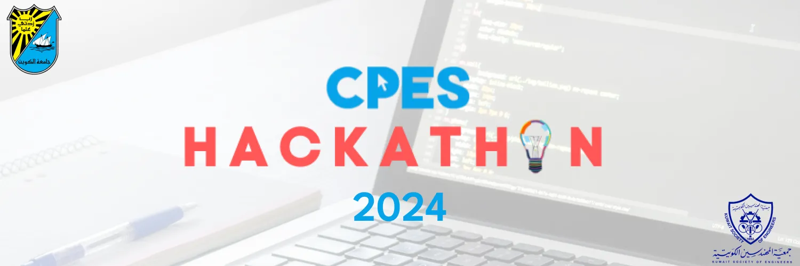

# [CPES Hackathon 2024]

---

## Introduction
[The hackathon was about a challange to solve 6 projects using any framework and any language that can deliver the projects as intended.]

## Tech Stack
- **Frontend**: Flutter, Dart, React, Flask
- **Backend**: Node.js, Express, SQL
- **Other Tools**: Bootstrap for styling, REST APIs
